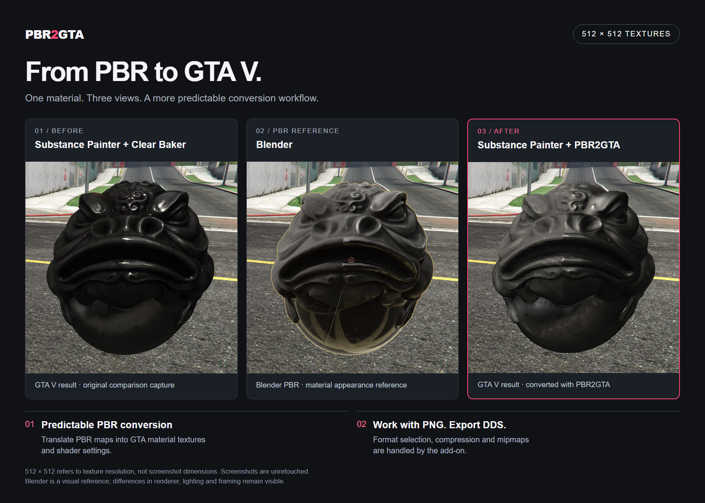
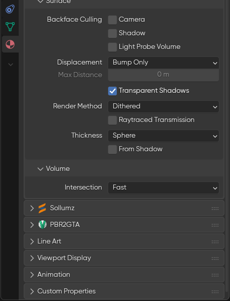
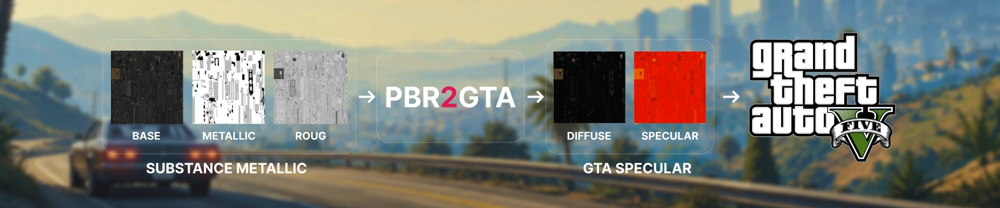
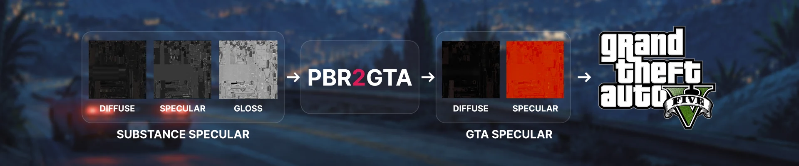

  

# PBR2GTA

**Мультитул для работы с шейдерами GTA V в Blender.**

PBR-конвертация, автоматическая подготовка DDS и справочник по шейдерам — в привычном процессе работы с Sollumz.

[English](README.md) · Русский

[Скачать](https://github.com/cre8vy/PBR2GTA/releases) · [Быстрый старт](docs/QUICKSTART.ru.md) · [Разработка](docs/DEVELOPMENT.md)

## Сравнение · текстуры 512 × 512

| Before | Референс из Blender | After |
| --- | --- | --- |
| Substance Painter + Clear Baker | PBR-материал в Blender | Substance Painter + PBR2GTA |
| [Полный кадр](docs/media/before.jpg) | [Полный кадр](docs/media/blender-reference.jpg) | [Полный кадр](docs/media/after.jpg) |

## Возможности

| | Что получаешь |
| --- | --- |
| **Предсказуемая PBR-конвертация** | Metallic/Roughness и Specular/Gloss с преобразованием текстур и настройкой параметров материала. |
| **Работа с PNG** | Автоматический выбор DDS-форматов, сжатие и mipmaps для поддерживаемых текстурных слотов. |
| **Справочник по шейдерам** | Инструкции для 296 вариантов шейдеров прямо в Blender, на русском и английском. |

## Где найти PBR2GTA

Выбери объект и его материал с шейдером Sollumz. В редакторе **Properties** открой **Material Properties** (иконка красного шара) и разверни **PBR2GTA** под панелью Sollumz.

Здесь находятся **Use PBR2GTA**, выбор workflow и исходных PNG, **Auto Detect Texture Set**, **Surface** и **Preview in Sollumz**. Кнопки **`?`** рядом с названием шейдера и Surface открывают соответствующую справку.

Экспорт выполняется командой **Export RAGE Assets** в Sollumz. Настройка NVTT находится в **Preferences → Add-ons → PBR2GTA**.

## Разберись в шейдере

Нажми **`?` рядом с текущим шейдером**, чтобы открыть инструкцию именно для выбранного варианта:

- **Карты** — текстурные слоты, назначение каналов и особенности использования.
- **Вертекс / UV** — вертексные цвета и требования к UV.
- **Параметры** — настройки материала, значения по умолчанию и их назначение.

Переключай **RU / EN** прямо в окне справки. Справочник работает без интернета и доступен независимо от PBR-конвертации.

## Конвертируй PBR-материалы

PBR2GTA преобразует исходные карты в GTA diffuse/specular и применяет соответствующие настройки поддерживаемого шейдера. **Surface** управляет откликом материала, а **Preview in Sollumz** позволяет посмотреть результат конвертации в Blender.

### Metallic / Roughness

### Specular / Gloss

Оба процесса поддерживают отдельную карту нормалей.

**Auto Detect Texture Set** заполняет входы текущего материала по именам файлов, как батч в вебе. Выбери workflow, нажми кнопку и укажи любой PNG нужного сета: например, `Toad_BaseColor`, `Toad_Metallic`, `Toad_Roughness`, `Toad_Normal`. Другие сеты и материалы не меняются. При нехватке или дублировании карт появится ошибка до назначения. Карта нормалей должна быть в формате DirectX.

## Автоматическая DDS-конвертация

Имена DDS берутся из материала: `Chain` создаёт `chain_d.dds`, `chain_s.dds` и `chain_n.dds`. Каждый материал получает свои текстуры, даже при общих исходных PNG. Совпадения имён разрешаются автоматически; итоговые имена видны в Advanced.

Работай с PNG — PBR2GTA подберёт оптимальный DDS-формат для каждого поддерживаемого текстурного слота с учётом назначения карты и требований к альфа-каналу. Аддон выполняет сжатие и создаёт mipmaps вплоть до **4 × 4 пикселей**. Конвертация выполняется локально через NVIDIA Texture Tools; для палитр используется отдельный профиль без mipmaps.

## Экспорт через Sollumz

При включённом **Use PBR2GTA** параметры шейдера постоянно откалиброваны в материале. Изменение **Surface** сразу обновляет шейдер. Выключение PBR2GTA прекращает контроль и оставляет текущие значения для ручного редактирования.

В **YDR и YDD** каждый включённый материал сохраняет собственный Surface, включая все Drawable и LOD. Общий материал конвертируется один раз. Экспорт записывает уже настроенные значения; PNG по-прежнему автоматически конвертируются в DDS.

Экспортируй привычной командой **Export RAGE Assets** в Sollumz. Для внешних текстур PBR2GTA дополнительно создаст **`ytd.xml` и папку с DDS** рядом с экспортированным YDR или YDD.

## Установка

**Требования:** Windows x64 · Blender 4.2+ · Sollumz 2.7+ · NVIDIA Texture Tools. [Проверенные релизы и форматы экспорта](docs/SOLLUMZ_COMPATIBILITY.md).

1. Установи Sollumz и скачай [ZIP PBR2GTA](https://github.com/cre8vy/PBR2GTA/releases).
2. В Blender открой **Edit → Preferences → Get Extensions → Install from Disk**, выбери ZIP и включи PBR2GTA.
3. В настройках PBR2GTA нажми **Check installation** для NVTT. Если он не установлен, скачай Standalone Application через **Download from NVIDIA**, установи и повтори проверку.

Для конвертации включи **PBR2GTA** в свойствах материала, выбери процесс и назначь PNG. Настрой **Surface**, посмотри превью и экспортируй.

[Подробная настройка и поддерживаемые исходники →](docs/QUICKSTART.ru.md)

---

**v0.2.13 · Alpha**

[GPL-3.0-or-later](LICENSE) · [Сторонние зависимости](THIRD_PARTY_NOTICES.md) · [Материалы сравнения](docs/media/README.md)
